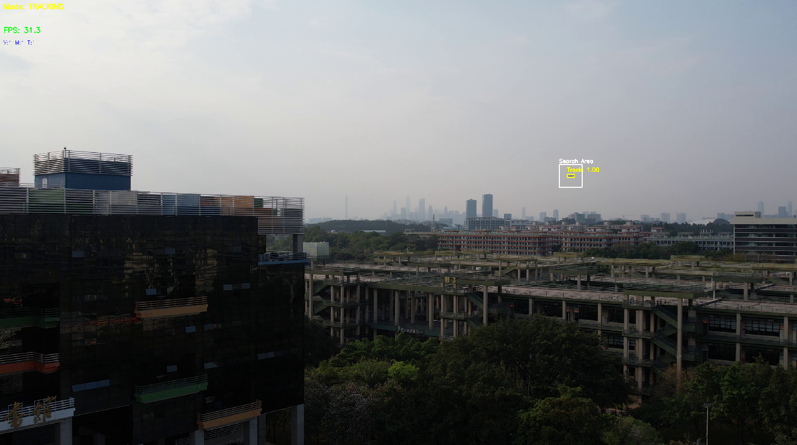

# 🚀 Hybrid High-Performance Object Tracking System

这是一个基于 **YOLOv5 (TensorRT)**、**LightTrack** 和 **MOD (运动目标检测)** 的高性能混合目标跟踪系统。

该项目专为 **NVIDIA Edge 设备 (如 Jetson) 或桌面显卡 (如 GTX 1650)** 优化，旨在解决单一算法在无人机/飞行器跟踪中的局限性，实现了**高帧率**与**高鲁棒性**的平衡。

  

## ✨ 核心特性

* **⚡ TensorRT 加速**: YOLOv5 检测器经过 TensorRT 引擎量化与加速，支持 FP16/FP32 推理。
* **🛠️ 混合架构 (TBD)**:
    * **检测 (Detect)**: 结合 YOLOv5 (针对已知类别) 和 MOD (针对运动物体) 进行全局搜索。
    * **跟踪 (Track)**: 使用 LightTrack 进行高帧率、高精度的单目标持续跟踪。
* **🧠 智能分帧策略 (Split-Frame Strategy)**:
    * **零卡顿切换**: 采用独创的“分帧初始化”逻辑，将耗时的跟踪器初始化操作分摊到两帧处理，彻底消除了从“检测”切换到“跟踪”时的瞬间掉帧现象。
* **🛡️ 鲁棒的 CUDA 上下文管理**:
    * 彻底解决了 PyCUDA (TensorRT) 与 PyTorch (LightTrack) 之间的 CUDA Context 冲突问题，确保多模型混合推理时的稳定性。

## 🏗️ 系统架构

  

系统采用有限状态机 (FSM) 进行调度：
1.  **SEARCHING (搜索模式)**:
    * 优先使用 **YOLOv5** 检测目标。
    * 若 YOLO 连续 N 帧失败，自动降级为 **MOD (运动检测)**。
2.  **INITIALIZING (初始化过渡)**:
    * 发现目标后的下一帧，利用缓存数据初始化 LightTrack，同时对当前帧进行跟踪（对用户透明，无感知延迟）。
3.  **TRACKING (跟踪模式)**:
    * 使用 **LightTrack** 进行高速跟踪。
    * 实时监控置信度 (Score)，若低于阈值 (如 0.98) 则触发重检测机制。
