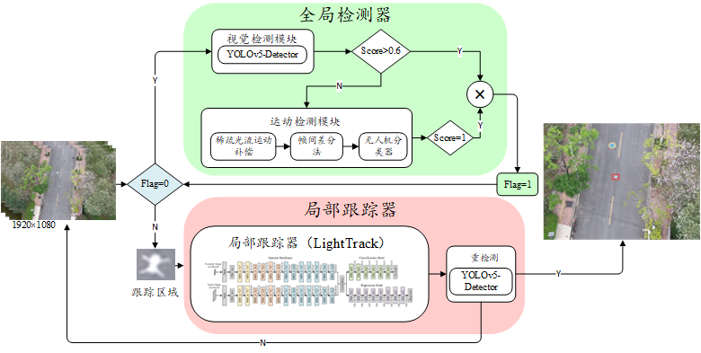

# YOLO_LT

基于 YOLOv5、LightTrack 和运动目标检测（MOD）的小目标检测与跟踪系统，提供 Python 和 C++ 两种实现。

## 系统流程

系统通过有限状态机调度三个模块：

1. **搜索阶段**：优先用 YOLOv5 检测目标，连续失败 N 帧后自动切换为 MOD 运动检测
2. **跟踪阶段**：用 LightTrack 进行单目标跟踪，每隔 N 帧由 YOLO 重新验证，置信度不足则回到搜索

<div align="center">
  
</div>

## 项目结构

```
YOLO_LT/
├── inference_py/        # Python 实现（TensorRT 推理）
├── inference_cpp/       # C++ 实现（ONNX Runtime 推理）
└── assets/              # 图片资源
```

## 使用

### Python

```bash
cd inference_py
python main.py
```

在 `main.py` 中配置启用的模块：

```python
ENABLE_CONFIG = {
    "VISUAL_DETECT": True,   # YOLOv5
    "MOTION_DETECT": True,   # MOD
    "TRACKING": True,        # LightTrack
}
```

### C++

```bash
cd inference_cpp
mkdir build && cd build
cmake .. && make -j$(nproc)
./Light_DT <model.onnx> <video_path>
```

## 依赖

- **Python**：PyTorch (CUDA)、TensorRT 8.6/10、OpenCV
- **C++**：C++17、OpenCV 4.6+、ONNX Runtime (CUDA)、CMake 3.10+

## 消融实验

项目包含在 ARD-MAV 和 GDUT-HWD 数据集上的消融实验脚本，用于评估各模块的贡献。

```bash
cd inference_py
python ablation_ARD.py
python ablation_GDUT.py
```
